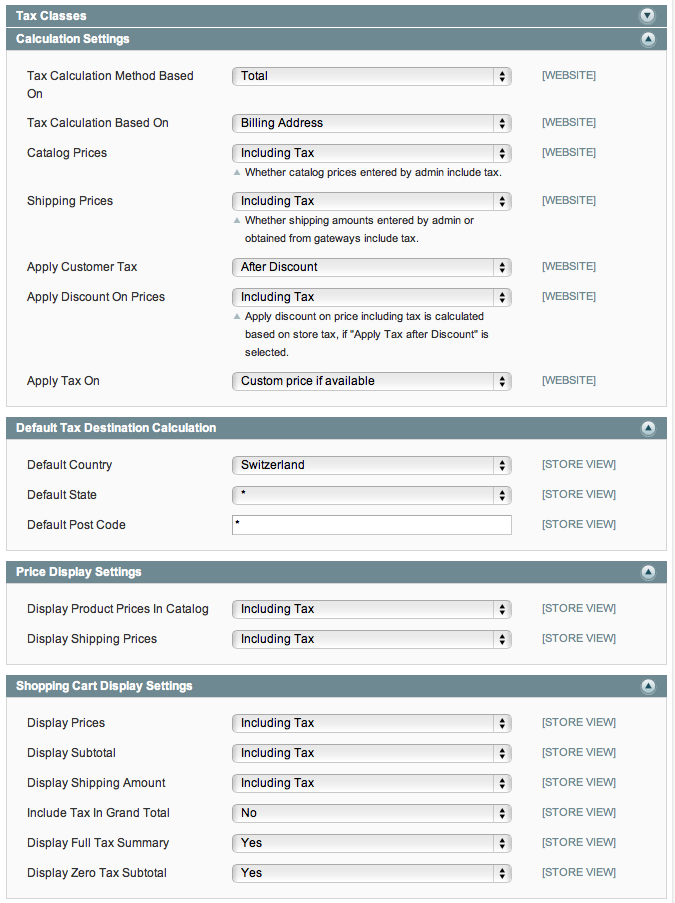

Diglin_Sales
============

Fix a hidden tax issue when using tax and discount into the Magento Backend

## Reason of this module

Since a long time our dear super Magento product have some issues with the tax calculation for european countries (maybe others too).
If you try to use discount code from the backend, you will get some curious display of the tax calculation.
The ground is, the hidden tax is not taken in account into the calculation in the backend.

***Hidden tax** is the amount of tax removed after a discount is applied on a product price including tax: e.g. With a VAT of 8%, the price is 150 CHF incl. VAT, the discount is 10% * 150 CHF = 15 CHF incl. VAT. Based on excluded VAT, the price is 138.89 CHF excl. VAT, the discount is 10% * 138.89 CHF= 13.89 CHF.
The hidden tax value is 15 – 13.89 = 1.11 CHF*

### Tax Settings

This problem appears when you set the following tax settings:

In fact, Magento doesn't support those settings and say officially that it's not a correct way. I don't have a clue why they think like that but this setting is definitely the good one after to have talk around me about this topic (accounting, other developers and merchant).

## Basic installation

Until I have the time to create a composer and modman files (or feel free to PR them ;-)), copy the files into the appropriate folder structure.

You will need the Admin Theme module to get allowed to overwrite admin template. Here is the link to the github module of [Inchoo_AdminTheme](https://github.com/ajzele/Inchoo_AdminTheme)

## Author

* Sylvain Rayé
* http://www.sylvainraye.com/
* [@sylvainraye](https://twitter.com/sylvainraye)
* [Follow me on github!](https://github.com/diglin)